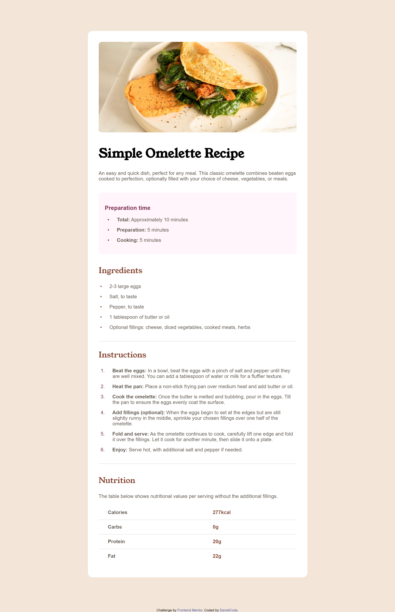

# Frontend Mentor - Recipe component solution

This is a solution to the [Recipe Component component challenge on Frontend Mentor](https://www.frontendmentor.io/challenges/recipe-page-KiTsR8QQKm). Frontend Mentor challenges help you improve your coding skills by building realistic projects. 

## Table of contents

- [Overview](#overview)
  - [Screenshot](#screenshot)
  - [Links](#links)
- [My process](#my-process)
  - [Built with](#built-with)
  - [Continued development](#continued-development)
- [Author](#author)

## Overview

### Screenshot

### Links

- Live Site URL: [Github Pages](https://danutzu2110.github.io/Recipe-Component/)

## My process

### Built with

- Semantic HTML5 markup
- CSS custom properties
- CSS Grid
- Vanilla CSS

### Continued development

I would like in the future to be a part of more complex projects and gain experience in this beautiful domain.

## Author

- Website - [DanielCode](https://www.danielcode.dev)
- Linkedin - [Marian-Daniel Prioteasa](https://www.linkedin.com/in/marian-daniel-prioteasa/)